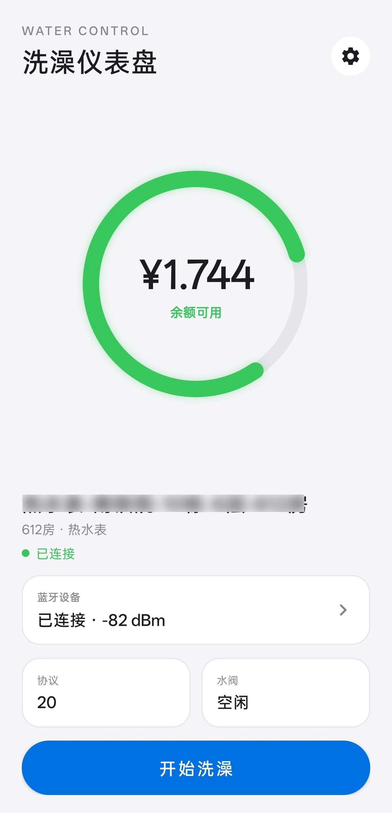

# 睿智校园

[](https://www.mozilla.org/MPL/2.0/)


趣智校园的第三方精简客户端，只做三件事：**连上宿舍的蓝牙水控、开阀关阀、看余额**。
界面重做过，没有广告和商城入口。

## 关于本仓库

这是 **[JDCK380/Funnyass_school](https://github.com/JDCK380/Funnyass_school)** 的 fork。

| | 来源 |
|---|---|
| 项目起因、协议逆向、蓝牙通信与登录/余额接口 | 上游作者（我朋友） |
| 本仓库 `fork` 之后的全部内容 | 由我继续开发 |

具体来说，**fork 之后**做的事情：

- 界面整体重做（Apple 风格），包括仪表盘圆环、设备列表、设置页
- 用页面替代弹窗式日志，新增「使用记录」
- 设备记住与自动重连、水阀状态、信号强度等一批显示问题修复
- 接入 GitHub Releases 做版本检查
- 补上 JVM 单元测试（37 项）

上游的协议解析、蓝牙收发包、登录与余额接口逻辑基本沿用，只做了必要修改。

## AI 辅助开发说明

fork 之后的工作以 **DeepSeek V4.1 Flash** 为主，**GPT-5.6 Sol** 为辅
（前期界面设计与方案讨论用得较多）。

代码、文档和测试都有 AI 参与生成，**尚未经过充分的人工审计**，请自行判断风险。
上游部分的工作方式请以原仓库说明为准。

## 界面预览

<p align="center">
  
</p>

<p align="center"><sub>洗澡仪表盘：余额、连接状态、协议与水阀状态</sub></p>

> 截图中的手机号已做模糊处理，状态栏已裁掉。

## 当前状态

当前版本 **1.0.2**，改动记录见 [`docs/CHANGELOG.md`](docs/CHANGELOG.md)。
仍在测试中，可能存在不稳定、设备不兼容、接口变更等问题，建议先小范围试用。

### 已实现

- 手机号验证码 / 密码登录，登录态本地保存
- 查询账户余额，小数位与服务端返回一致（不做四舍五入）
- 扫描并连接 `KLCXKJ-Water` 蓝牙水控，**记住上次设备并在启动后自动重连**
- 开始供水、停止供水
- 界面显示设备真实状态（空闲 / 使用中 / 不可中断 / 有遗留数据），避免误动别人的设备
- **使用记录**：每次用水结束记录时间、时长、花费（花费取服务端余额差额），可清空
- **全屏诊断日志**：方便出问题时导出排查
- **检查更新**：与 GitHub Releases 比对版本，有新版本可一键跳转下载
- 无广告

### 暂不支持

- 充值
- 微信小程序

## 计费说明

**本客户端不参与计费。**

它只负责发开闸/关闸指令、读余额、显示状态。扣费由趣智校园**服务端按实际用水量自动完成**，
客户端没有预扣逻辑，也不保存任何订单金额。

因此客户端上传消费记录失败**不影响实际扣费**，只是少一条对账数据；
关阀后的余额一律以服务端为准。

## 使用方法

1. 从 [Releases](https://github.com/LVSUGARS/Funnyass_school-sugars-/releases) 下载安装最新 APK
2. 打开「睿智校园」，用校园账户登录
3. 按提示授予蓝牙 / 「附近的设备」权限，并打开蓝牙
4. 进入 **蓝牙设备** → 点 **重新扫描附近设备**，在列表里找到目标水控
   （可结合房间名、编号、信号强度判断，**不要操作不属于自己的设备**）
5. 点选设备完成连接，等状态显示 **空闲** 后点「开始洗澡」
6. 用完后点「停止并结算」。设备先关阀，随后尝试上传消费记录；
   即使上传失败，本次用水也已结束，余额会在关阀后刷新
7. 下次打开 App 会自动重连上次的设备。要换设备就在列表里选别的（自动切换），
   不想用了就点「断开连接」

## 构建

建议用 Android Studio 打开，并装好项目所需的 Android SDK。

```powershell
# Windows
.\gradlew.bat :app:testDebugUnitTest :app:assembleDebug
```

```bash
# macOS / Linux
./gradlew :app:testDebugUnitTest :app:assembleDebug
```

产物路径：

```text
app/build/outputs/apk/debug/睿智校园-<版本号>.apk
```

最低支持 Android 7.0（API 24）。当前 APK 只带 `arm64-v8a` 原生库，其他架构可能跑不起来。

### 发布新版本

版本号有**四处**必须一起改，漏一处会出现界面和包内版本不一致：

1. `app/build.gradle.kts` 的 `versionCode`（递增整数）和 `versionName`
2. `BathActivity.APP_VERSION`
3. `res/layout/bottom_sheet_settings.xml` 里的「当前版本」
4. `androidTest/.../BathUiSmokeTest.kt` 里的版本断言

然后打 tag 并上传 APK：

```bash
gh release create v1.0.3 "app/build/outputs/apk/debug/睿智校园-1.0.3.apk" \
  --repo LVSUGARS/Funnyass_school-sugars- --title "v1.0.3" --notes "更新说明"
```

两点注意：

- App 里「检查更新」读的是 `releases/latest` 的 `tag_name`，所以 tag 要写成 `v1.0.3` 这种格式
- **APK 建议先用 ASCII 文件名再上传**（例如 `RuiZhiXiaoYuan-1.0.3.apk`），
  直接传中文名会因为编码问题变成 `-1.0.3.apk`

## 项目结构

```text
app/src/main/java/com/funnyass/test/
├── ui/        BathActivity（仪表盘 / 设备列表 / 设置与子页面）、LoginActivity
├── ble/       BleManager：扫描、连接、收发帧、RSSI
├── net/       Api / ApiClient：接口与签名
├── store/     Session（登录态）、UsageLog（使用记录）
├── update/    UpdateChecker：GitHub Releases 版本比对
└── util/      FrameUtils（协议组帧解析）、Crypto、Logger
```

调试用的命令端口（debug 包自动开启，监听 `127.0.0.1:8080`）：

```bash
adb forward tcp:8080 tcp:8080
curl "http://127.0.0.1:8080/log"                                # 读日志
curl "http://127.0.0.1:8080/cmd?action=connect&mac=<设备 MAC>"   # 触发连接
```

## 隐私与安全

- 发 Issue 或日志前，请先删掉手机号、验证码、密码、登录令牌、账户编号、设备 MAC、消费订单等信息
- 不确定设备归属时，不要尝试开阀或关阀
- 提示登录失效就重新登录；正在供水时优先把阀关掉
- 这个项目能操作真实账户和设备，别当成完全可靠的生产软件用

## 非官方声明

本项目为非官方社区项目，与趣智校园、相关运营方、学校及设备厂商不存在隶属、合作或授权关系。
「趣智校园」「KLCXKJ」等名称、商标和服务归各自权利人所有。官方接口和设备协议随时可能变，不保证一直可用。

请仅在法律、学校规定和服务条款允许的范围内，把它用于自己有权使用的账户与设备。
因使用、修改或分发本项目造成的账户、费用、设备或其他损失，由使用者自行承担。

如果任何权利人或相关方认为本项目中的代码、二进制、图片、名称或其他内容存在权利问题，
请通过本仓库的 Issue 联系，我会核查并删除或替换。

## 开源协议

本项目中由项目作者享有著作权并有权许可的原创代码，以
[Mozilla Public License 2.0](LICENSE) 发布。

MPL-2.0 是文件级 Copyleft：对 MPL 源文件的修改仍需按 MPL-2.0 提供源码，
但允许这些文件与其他许可证的独立文件组成更大的作品。它不会改变第三方组件、商标、
素材、服务接口或二进制原有的权利归属。

### 发布前特别注意

工程里有两个文件需要发布者自己确认分发权利：

- `app/src/main/jniLibs/arm64-v8a/libklcxkjencry.so`：设备协议用的原生二进制库
- `app/src/main/res/drawable-nodpi/ic_launcher_ruizhi_no_ads.png`：基于原应用图标做的衍生图标

拿到明确授权或换成可合法分发的实现之前，不建议把这两个文件随源码或 APK 一起公开分发。
仓库用 MPL-2.0 不代表这些第三方内容自动获得 MPL-2.0 授权。

## 参与贡献

欢迎提 Issue 和 PR，尤其是：

- 不同学校、宿舍、水控设备的兼容性反馈
- 蓝牙稳定性、计费安全、异常恢复
- 登录失效处理、界面与无障碍体验
- 充值和微信小程序适配

发日志前请务必先删掉个人信息和服务端凭据。
